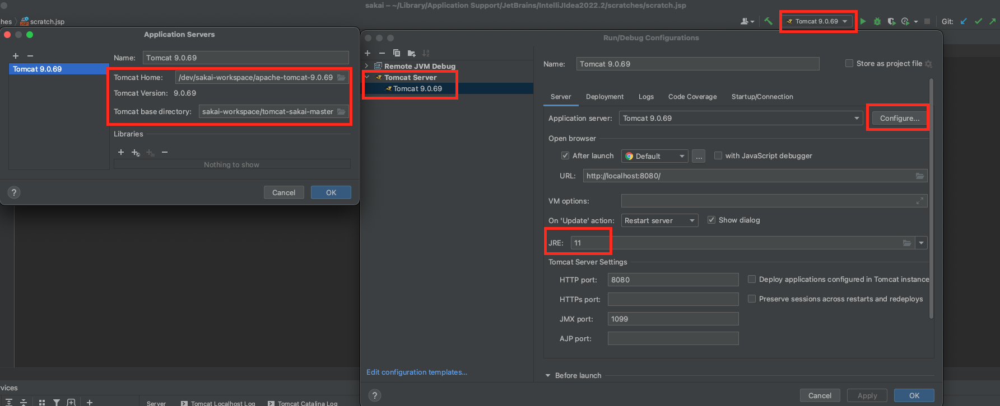

# Sakai Installation

## Pre-Requisites

- Java-11(JDK)
- Maven-3.6.3
- Tomcat-9
- Mysql-8

## Set Maven and Java Paths

- Open ~/.zshrc file

```code
vi ~/.zshrc
```

- Add Java and Maven paths to the end of the file. Note: modify ```JAVA_HOME``` and ```MAVEN_HOME``` based on your computer setting.

```code
# Set Java path
export JAVA_HOME="/Library/Java/JavaVirtualMachines/jdk-11.0.16.1.jdk/Contents/Home"
export PATH=$JAVA_HOME/bin:$PATH

# Set Maven path
export MAVEN_HOME=path/to/your/apache-maven-3.6.3
PATH=$PATH:$MAVEN_HOME/bin
export MAVEN_OPTS='-Xms1024m -Xmx2048m'
```

- Update ./zshrc

```code
source ./zshrc
```

- Verify if the setup is successful.

```code
java -version
mvn -version
```

## Install mariaDB

```code
brew install mariadb
```

## Set up the database for Sakai

```code
mysql -u root -p
# enter password root1234

create database sakaidb default character set utf8;

create user 'sakaiuser'@'localhost' identified by 'sakaipassword';

grant all on *.* to 'sakaiuser'@'localhost';

create user 'sakaiuser'@'127.0.0.1' identified by 'sakaipassword';

grant all on *.* to 'sakaiuser'@'127.0.0.1';

flush privileges;
```

## Create Sakai Workspace

Create working directories:

```code
# from you home directory
# create a folder to keep all sakai stuff

mkdir sakai-workspace
cd sakai-workspace

# create a folder to store sakai.properties file
mkdir home
cd home

touch sakai.properties
```

Paste the following code to ```sakai.properties``` file:

```code
# Only for development purposes
# mysql username and password
username@javax.sql.BaseDataSource=root
password@javax.sql.BaseDataSource=root1234

## MySQL settings
vendor@org.sakaiproject.db.api.SqlService=mysql
driverClassName@javax.sql.BaseDataSource=org.mariadb.jdbc.Driver
hibernate.dialect=org.hibernate.dialect.MySQL5InnoDBDialect
url@javax.sql.BaseDataSource=jdbc:mysql://127.0.0.1:3306/sakaidb?useUnicode=true&characterEncoding=UTF-8?useSSL=false&allowPublicKeyRetrieval=true
validationQuery@javax.sql.BaseDataSource=select 1 from DUAL
defaultTransactionIsolationString@javax.sql.BaseDataSource=TRAN
```

Download the latest tomcat-9 from [Official Website](https://tomcat.apache.org/download-90.cgi).

Extract the tomcat in the ```sakai-workspace``` folder.

Create ```tomcat-sakai-master``` folder.

Under ```tomcat-sakai-master``` folder, download the ```tomcat-sakai-template.tgz``` file from [here](https://github.com/zhuoY121/sakai-repo/blob/main/resources/tomcat-sakai-template.tgz).

Extract ```tomcat-sakai-template.tgz``` file.

```code
cd sakai-workspace
mkdir tomcat-sakai-master

cd tomcat-sakai-master
tar -czf tomcat-sakai-template.tgz

# remove the .tgz file
rm tomcat-sakai-template.tgz
```

Copy ```conf``` folder from tomcat to ```tomcat-sakai-master``` folder.

```code
cd sakai-workspace

# copy "conf" folder from tomcat to "tomcat-sakai-master/conf"
cp -r <path-to-tomcat>/conf/* tomcat-sakai-master/conf
```

Add the following code to ```tomcat-sakai-master/conf/context.xml``` file.

```code
<JarScanner>
    <!-- This is to speedup startup so that tomcat doesn't scan as much -->
    <JarScanFilter defaultPluggabilityScan="false" />
</JarScanner>
```

Comment out the codes in ```tomcat-sakai-master/bin/setenv.sh```. And Add the following code to the top of this file.

```bash
# Modify the path
CATALINA_HOME="/path/to/sakai-workspace/apache-tomcat-9.0.69"
CATALINA_BASE="/path/to/sakai-workspace/tomcat-sakai-master"

JRE_HOME=$JAVA_HOME
CATALINA_OPTS="-server -Xmx4g -XX:MaxMetaspaceSize=1g -Djava.awt.headless=true -XX:+UseCompressedOops -XX:+UseConcMarkSweepGC -XX:+DisableExplicitGC -Djava.util.Arrays.useLegacyMergeSort=true"
CATALINA_OPTS="$CATALINA_OPTS -Dhttp.agent=Sakai"
CATALINA_OPTS="$CATALINA_OPTS -Dorg.apache.jasper.compiler.Parser.STRICT_QUOTE_ESCAPING=false"
CATALINA_OPTS="$CATALINA_OPTS -Dsakai.security=$CATALINA_BASE/sakai/"
CATALINA_OPTS="$CATALINA_OPTS -Dsakai.home=$CATALINA_BASE/sakai/"
CATALINA_OPTS="$CATALINA_OPTS -Dsakai.cookieName=SAKAI2SESSIONID"
# CATALINA_OPTS="$CATALINA_OPTS -Dsakai.demo=true"
CATALINA_OPTS="$CATALINA_OPTS -Duser.timezone=US/Eastern"
CATALINA_OPTS="$CATALINA_OPTS -Duser.language=en -Duser.region=ES"
```

## Download the source code

[Sakai Source Code](https://github.com/sakaiproject/sakai)

```code
cd sakai-workspace

git clone https://github.com/sakaiproject/sakai

cd sakai
```

Build the source code. Note: modify ```-Dmaven.tomcat.home``` based on your computer setting.

```code
# -Dmaven.test.skip=true : skip test
# -T 4C : accelerate the building process.
mvn clean install -Dmaven.test.skip=true -T 4C -Dmaven.tomcat.home=path/to/sakai-workspace/tomcat-sakai-master sakai:deploy-exploded -Dsakai.cleanup=true
```

Test Sakai app.

```code
cd sakai-workspace/tomcat-sakai-master

# start the tomcat server and print the log file.
bin/start.sh; tail -f logs/catalina.out
```

Open the browser and paste the link:

[http://127.0.0.1:8080/portal](http://127.0.0.1:8080/portal)

Stop the server.

```code
# stop the server
# First: cmd + c (macOS) OR ctrl + c (Windows) to kill the program
# Second: 
bin/stop.sh
```

## Intellij IDEA Setup

Install Intellij IDEA from [here](https://www.jetbrains.com/idea/download/)

Configure the tomcat server following the instructions below:



```code
# The version of tomcat might be different
Tomcat Home: /path/to/sakai-workspace/apache-tomcat-9.0.69 

Tomcat base directory: /path/to/sakai-workspace/tomcat-sakai-master
```

Now you can run the tomcat server using IDEA.


## Errors and Solutions

### An error when compiling sakai 22.x

```code
[ERROR] Failed to execute goal com.gitlab.haynes:libsass-maven-plugin:0.2.26:compile (default) on project library: Execution default of goal com.gitlab.haynes:libsass-maven-plugin:0.2.26:compile failed: An API incompatibility was encountered while executing com.gitlab.haynes:libsass-maven-plugin:0.2.26:compile: java.lang.UnsatisfiedLinkError: Can't load library: /var/folders/77/qstzpyd15h782vcmx3zzhy7c0000gn/T/libjsass-11124651531030339020/libjsass.dylib
[ERROR] -----------------------------------------------------
[ERROR] realm =    plugin>com.gitlab.haynes:libsass-maven-plugin:0.2.26
[ERROR] strategy = org.codehaus.plexus.classworlds.strategy.SelfFirstStrategy
[ERROR] urls[0] = file:/Users/cs/.m2/repository/com/gitlab/haynes/libsass-maven-plugin/0.2.26/libsass-maven-plugin-0.2.26.jar
...
```

Solution: Using x64 JDK to compile.

- Install [sdkman](https://sdkman.io/) (JDK manager)
- For mac M1 chip, you need to enable rosetta.
  - Right Click "iterm2" => Click on "Get info" => Check "Open using Resetta"
  - In terminal, run
    - ```$ sdk config```
  - Set ```sdkman_rosetta2_compatible=true```
- In teriminal, run ```$ sdk list java``` to find a JDK version.
- Install a JDK e.g.
  - ```$ sdk install java 11.0.17-zulu```
- Check JDK version:
  - ```$ cat `which java` | file -```
  - Should display: ```architecture x86_64```
- Note: Sdkman will add settings to the ```.zshrc``` file, which will modify the ```JAVA_HOME``` variable accordingly.

## References

- [Kunal's article (Sakai Developer)](https://kunaljaykam.medium.com/how-to-install-sakai-lms-on-mac-b1a66bc0e103)
